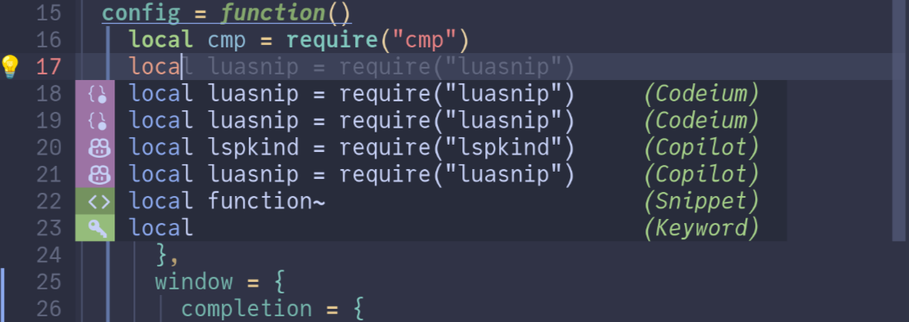
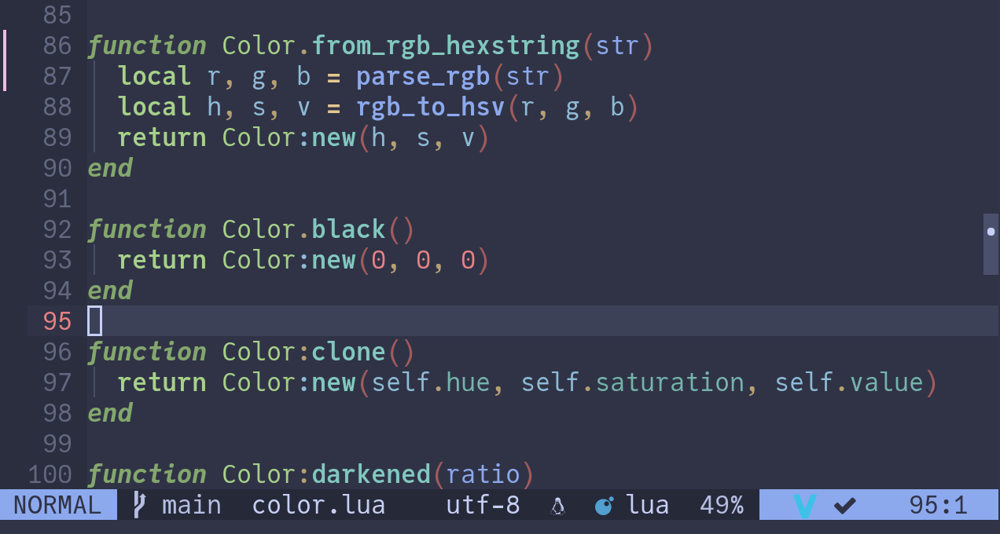
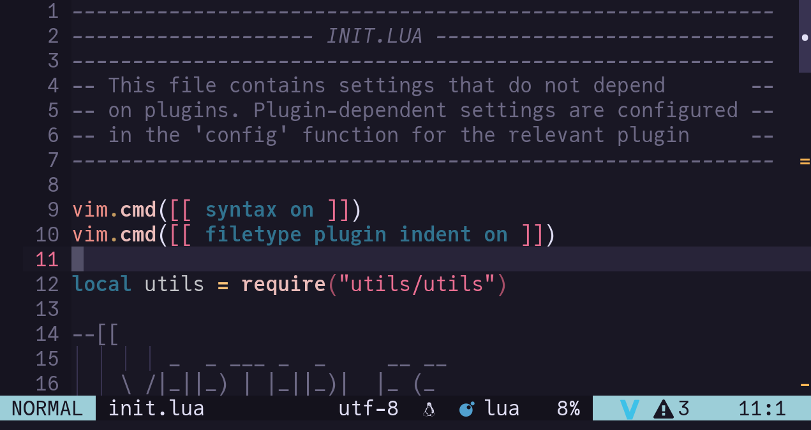

# wal-colors.nvim

A colorscheme and lualine theme based on pywal-generated colors, but using
more shaded and interpolated variants of the generated colors to have more than
16 colors on screen.

The project includes a Lua API for accessing variants of cached pywal-generated colors for those that
would like to use them in their own projects or colorschemes.

## Screenshots

Screenshots taken with different pywal themes.

### Catpuccin (frappe)




### Apprentice


### Rose Pine



## Installation

Simply install with your plugin manager of choice.

### lazy.nvim

Create a `wal-colors.lua` in your plugin directory of choice, with contents:

```lua
return {
  "mbrea-c/wal-colors.nvim",
  config = function()
    vim.cmd([[colorscheme mbc]]) -- activate the colorscheme
  end,
  priority = 1000, -- recommended to ensure the colorscheme
                   -- is loaded before other plugins
}
```

## Tweaking colorscheme in configuration

In case some highlights look bad or don't look as intended with your configuration,
it is also possible to tweak an existing colorscheme in your configuration after applying it.
Simply use the following pattern **after** applying your desired colorscheme:

```lua
-- ...
local tweaks = function(colors)
  return {
    LspReferenceText = { fg = colors.background, bg = colors.foreground },
    LspReferenceRead = { fg = colors.background, bg = colors.foreground },
  }
end

-- `replace = false` indicates indicates that we want to update
-- the configuration for any given highlight group rather than completely
-- replacing it (which would be the default behavior for `nvim_set_hl`)
require("wal-colors").setup(tweaks, { replace = false })
-- ...
```

### nvim-cmp configuration

In order to configure cmp to look as in the screenshots, install the
[lspkind](https://github.com/onsails/lspkind.nvim) and add the following
code to your cmp configuration table:

```lua
cmp.setup({
  -- ... (other stuff) ...
  window = {
    completion = {
      col_offset = -3,
      side_padding = 0,
    },
  },
  formatting = {
    fields = { "kind", "abbr", "menu" },
    format = function(entry, vim_item)
      local kind = require("lspkind").cmp_format({ mode = "symbol_text", maxwidth = 50 })(entry, vim_item)
      local strings = vim.split(kind.kind, "%s", { trimempty = true })
      kind.kind = " " .. (strings[1] or "") .. " "
      kind.menu = "    (" .. (strings[2] or "") .. ")"

      return kind
    end,
  },
  -- ... (other stuff) ...
})
```

## API Quickstart

```lua
local ColorSpec = require("wal-colors.core").ColorSpec
local colors = ColorSpec.load() -- Access an instance of the ColorSpec table

print(colors.color3:out()) -- Hex representation (e.g. #1FABFF) of color 3
print(colors.yellow:out()) -- Equivalently, you can access colors by name

-- Colors can be manipulated via their methods
-- A floating point argument specifies the percentage by which to
-- perform specified operation
-- See the file `wal-colors/colors.lua` for the full api of the Color class
local dark_red = colors.red:darkened(0.3)
local light_red = colors.red:lightened(0.2)
local dark_desaturated_red = dark_red:desaturated(0.1)
local light_saturated_red = colors.red:lightened():saturated(0.1)
 -- Interpolate between two colors in the RGB colorspace
local orange = colors.red:mixed_rgb(colors.yellow)
 -- Interpolate between two colors in the HSV colorspace
local orange_hsv = colors.red:mixed_hsv(colors.yellow)
 -- Interpolation functions support an optional `ratio` argument, defaulting to 0.5
 -- Values closer to 0 result in the final color begin closer to the first color
 -- argument, whereas values closer to 1 result in the final color being closer
 -- to the second
local almost_red = colors.red:mixed_hsv(colors.yellow, 0.1)

print(orange:out())

-- A colorscheme configuration is a function that accepts a ColorSpec
-- table and returns a table where
--   - the keys are highlight group names
--   - the values are highlight definition maps accepted by `nvim_set_hl()` (see
--     `:h nvim_set_hl` for details). The exception is that, for convenience,
--     it is allowed to leave Color class instances in the fields that accept
--     hex color strings. E.g. we can do
--         Function = { fg = colors.blue }
--     instead of
--         Function = { fg = colors.blue:out() }
--
-- A colorscheme configuration as follows:
local configuration = function(colors)
  return {
    Function = { fg = colors.blue:lightened(), bold = true }
    Identifier = { fg = colors.cyan, bold = true }
  }
end

require("wal-colors").setup(configuration)
```
